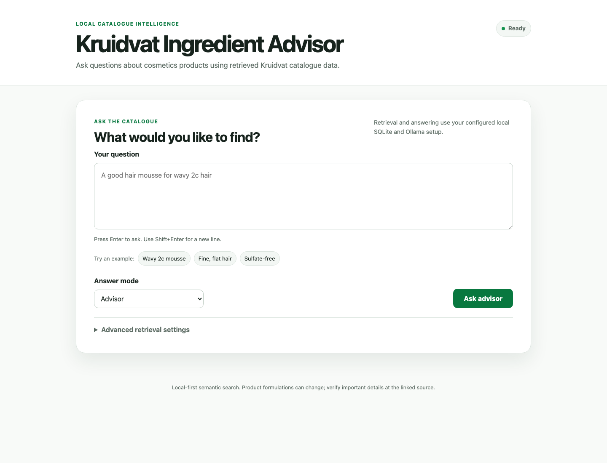

# Kruidvat Ingredient Advisor

A polished, local-first web and CLI application for asking natural-language questions about [Kruidvat](https://www.kruidvat.nl)'s cosmetics catalogue. It retrieves semantically relevant products from SQLite/sqlite-vec, asks a locally configured Ollama model for a grounded answer, and shows the exact catalogue products used as evidence.



## Quick start

```bash
python -m venv .venv
source .venv/bin/activate
pip install -r requirements.txt
python -m playwright install chromium

ollama pull embeddinggemma
ollama pull gemma4:12b-mlx  # use a portable tag off Apple Silicon
python scraper.py
python embed.py
uvicorn app.main:app --reload
```

Open <http://127.0.0.1:8000>. The original CLI remains available with `python query.py "A good hair mousse for wavy 2c hair"`.

The catalogue is a JavaScript-rendered storefront behind bot protection, so the data isn't in the page HTML. Instead of brittle DOM scraping, the pipeline reads clean, structured records straight from Kruidvat's own SAP Commerce (OCC) API, the same API the site uses. The only thing the browser is for is clearing the bot check and cookie consent once; everything after that is fast, structured API calls.

## Technology stack

- **Backend:** Python 3.11, FastAPI, and Pydantic
- **Retrieval and storage:** SQLite and sqlite-vec
- **Models:** Ollama through provider-neutral embedding and answer adapters
- **Data collection:** Playwright, playwright-stealth, and Kruidvat's SAP Commerce API
- **Frontend:** semantic HTML, CSS, and vanilla JavaScript with streamed NDJSON responses
- **Quality:** pytest integration/API/unit tests and GitHub Actions CI

## Motivation

I kept buying cosmetics with ingredients I wanted to avoid. When I asked general AI assistants (ChatGPT, Claude, Gemini) what was in a product, the answers weren't reliable: often based on outdated formulations, confusing the US and EU versions of the same product (which frequently differ), or simply hallucinating ingredients that weren't there.

The problem isn't that the models are bad. A general model's memory is just the wrong place to look for specific, current, region-dependent facts. The fix is grounding: give the model the real, up-to-date ingredient data and let it answer from that instead of from memory.

This project builds that grounding layer: collecting Kruidvat's current EU catalogue into a structured, queryable database of products, their descriptions, and their actual ingredients, ready to ground an LLM for more reliable answers.

## Example

A real run, in the default advisor mode. The question is about *high-porosity 2c* hair, an attribute the catalogue does not record, so a strict lookup would simply refuse. The advisor instead reasons from each retrieved product's ingredients and description and makes a recommendation (output abridged):

```text
$ python query.py "Which hair mousse is best for high porous 2c hair?"

Top 10 matches:
  [1.025] Got2b Twisted Hold 3 Curling Mousse  .../p/6475236
  [1.047] Cantu Avocado Hydrating Styling Mousse  .../p/6397536
  [1.048] John Frieda Frizz-Ease Air-Dry Waves Styling Mousse  .../p/3331196
  [1.048] Umberto Giannini Curl Whip Activating Mousse  .../p/5823123
  ... (6 more)

Answer:
High-porosity hair has a raised cuticle: it takes on moisture easily but loses
it quickly, so it wants moisture and sealing without a heavy, drying formula.
The catalogue does not record porosity or curl type (2c), so suitability is
inferred from each product's own ingredients and description.

1. Cantu Avocado Hydrating Styling Mousse
   Catalogue facts: contains Persea Gratissima (Avocado) Oil, Butyrospermum
     Parkii (Shea) Butter, Mel (Honey), Panthenol and Silk Amino Acids.
   Judgment: effectively a "treatment mousse"; the oils and butter give the
     richer moisture that helps seal the cuticle of high-porosity hair.

2. Umberto Giannini Curl Whip Activating Mousse
   Catalogue facts: description says "intense hydration", a "lightweight formula"
     for "all curl types"; contains Propylene Glycol (a humectant).
   Judgment: a good lighter option, since high-porosity hair is weighed down easily.

3. John Frieda Frizz-Ease Air-Dry Waves Styling Mousse
   Catalogue facts: contains Rosa Canina (rosehip) Fruit Oil; described as a
     "curl-loving, anti-frizz" formula.
   Judgment: rosehip nourishes porous strands and helps smooth frizz.

Products to be cautious with:
- Andrélon Power Hold Mousse: contains Alcohol Denat. and is built for a
  "strong hold", which can be drying and stiff on porous hair.
```

Notice three things: it states outright that porosity and curl type are not in the catalogue rather than refusing or bluffing; every ingredient is a "Catalogue fact" copied from that product's own list (each one above was verified against the database); and the haircare reasoning is kept in a separate "Judgment" line as the model's own. Ask the same question with `--mode strict` to get only what the ingredient lists literally say.

## Highlights

- **Structured data, straight from the source**: rather than parsing fragile HTML or running an LLM over each page, it reads clean product records (name, description, INCI ingredients) from Kruidvat's SAP Commerce (OCC) API, which is fast and reliable, with no per-page extraction step.
- **Gets past the bot wall once**: the catalogue is a JS-rendered SPA behind Akamai bot protection and a OneTrust consent gate. A stealthed Chromium ([`playwright-stealth`](https://pypi.org/project/playwright-stealth/), Chrome's new headless mode, an nl-NL / Europe-Amsterdam profile) clears both once; the API calls then run from inside that browser context and inherit its cookies (a plain server-side request gets a `403`).
- **Captures descriptions, not just ingredients**: each product's use-case/marketing description is saved alongside its INCI list, so questions like *"best shampoo for dry, damaged hair"* work, not only exact-ingredient lookups.
- **Multilingual semantic embeddings**: by default, a second pass embeds each product locally with [`embeddinggemma`](https://ollama.com/library/embeddinggemma) (Google's multilingual embedding model, a good fit for the Dutch descriptions + Latin INCI names) and stores the vectors in the same SQLite file via [sqlite-vec](https://github.com/asg017/sqlite-vec), making the catalogue searchable by meaning.
- **Web and CLI, one shared pipeline**: FastAPI and `query.py` call the same service. Both embed the complete question, retrieve the closest products once, and feed those descriptions and ingredients to the configured local answer model.
- **Grounded Q&A, with an advisor mode**: by default it answers as an *advisor*, combining real product facts with general haircare knowledge to make a recommendation (and staying clear about which is which); strict mode keeps it inside the retrieved data for exact ingredient lookups.
- **One place to configure**: `config.py` holds the shared defaults (database path, model names, prompt prefixes, Ollama host, and the list of categories to scrape); every script accepts CLI flags that override them per run.
- **Provider-independent model boundary**: indexing, query embedding, complete answers, and streamed answers use small provider interfaces. Ollama is the only adapter today, while future local or cloud adapters can be added without changing retrieval, prompts, the CLI, or API.
- **Embedding-index safety**: new and rebuilt indexes record their provider, model, dimension, and prompt prefixes. Querying fails clearly if that profile does not match the configured embedding adapter instead of silently returning meaningless neighbours.
- **Idempotent + incremental**: SQLite (WAL mode) with batched inserts, URL de-duplication, and skip-already-scraped logic so runs can be resumed. Embedding is incremental too, so re-runs only process new products.

## Architecture

The three commands and `config.py` live at the repo root. FastAPI, the shared RAG service, and browser assets live in `app/`; scraping support remains in `lib/`:

| File | Responsibility |
|------|----------------|
| `config.py` | Shared defaults: database path, model names, prompt prefixes, Ollama host, category list |
| `scraper.py` | Command: scrape a category via the API (list → product details → store) |
| `embed.py` | Command: embed products into a `sqlite-vec` vector table |
| `query.py` | Backwards-compatible CLI using the shared RAG service |
| `app/service.py` | Shared validation, embedding, KNN retrieval, context, answering, health, and product lookup |
| `app/providers/` | Provider-neutral contracts, factories, and the Ollama embedding/answer adapters |
| `app/index_metadata.py` | Stored embedding-profile identity and compatibility checks |
| `app/main.py` | FastAPI routes and static frontend serving |
| `app/static/` | Responsive HTML, CSS, and vanilla JavaScript interface |
| `lib/api.py` | Kruidvat OCC API client: consent/bot-check, paginated product list, product detail |
| `lib/browser.py` | Playwright stealth context + cookie-consent handling |
| `lib/extractor.py` | INCI ingredient-string parsing and cleaning helpers |
| `lib/db.py` | SQLite schema and batched persistence |
| `tests/` | Unit + integration tests (run with `pytest`) |

The answering path is intentionally fixed and single-step:

```text
Browser or CLI
      ↓
FastAPI / query.py
      ↓
shared RAG service
      ↓
complete question → embedding provider → sqlite-vec nearest-neighbour retrieval
      ↓
grounded context → answer provider (complete or streamed)
      ↓
answer + structured retrieved-product evidence
```

There is no keyword pre-filter, reranker, query planner, agent, or multi-step retrieval.

## Setup

Requires Python 3.11+ and a running [Ollama](https://ollama.com) instance. Ollama is used for **embedding** and **answering** (the scrape itself needs no model), so it must be installed and serving before you embed or query.

```bash
# 1. Create and activate a virtual environment
python -m venv .venv && source .venv/bin/activate

# 2. Install Python dependencies (includes playwright-stealth and sqlite-vec) + the browser
pip install -r requirements.txt
python -m playwright install chromium

# 3. Pull the models and make sure Ollama is running
ollama pull embeddinggemma      # semantic embeddings (embed + query)
ollama pull gemma4:12b-mlx      # grounded answers; choose a compatible tag off Apple Silicon
ollama serve   # if not already running (default: http://localhost:11434)
```

## Configuration

Shared defaults live in `config.py`: the database path, model names, the Ollama host, and the `CATEGORIES` list that `scraper.py` crawls by default. Edit that file to change them globally, or pass the matching CLI flag to override a single run.

A few things worth knowing:

- **Embedding prompt prefixes.** EmbeddingGemma embeds documents and queries with different task instructions, kept in `config.py` as `EMBED_DOC_PREFIX` / `EMBED_QUERY_PREFIX`. If you switch to a model with other conventions (e.g. `bge-m3` needs none), update or empty them there.
- **Separate providers.** `EMBED_PROVIDER` selects the adapter used by both `embed.py` and question retrieval; `ANSWER_PROVIDER` selects the adapter that writes complete and streamed answers. Both are `ollama` today. Provider-specific HTTP payloads, streaming, and errors live under `app/providers/`, not in the RAG service.
- **Embedding profiles are index-wide.** A question must use the same embedding provider, model, dimension, document prefix, and query prefix as the stored product vectors. Changing any of those requires `python embed.py --reset`. An answer provider can be changed independently because it receives text rather than vectors.
- **Legacy indexes.** A vector index created before profile metadata was introduced remains readable for compatibility. Rebuild it once with `python embed.py --reset` to record and enforce its identity.
- **Answer-model capacity affects grounding.** The advisor reasons over all `TOP_K` retrieved products in a single prompt, so it has to keep each product's ingredient list separate. In testing, `gemma4:e4b-mlx` (about 4b effective parameters) still produced cross-attribution mistakes at `TOP_K = 10` even with the grounding fixes in the prompt and context, crediting one product with an ingredient that actually belonged to another. Switching the answer model to `gemma4:12b-mlx` removed those in our checks. If you stay on a smaller model, lowering `TOP_K` (fewer products to track at once) is the cheaper lever. This only concerns ingredient grounding: any model can still get a "what does this ingredient do" judgement wrong, which is a separate problem from attribution.

## Usage

Prepare the catalogue by scraping and embedding, then use either the browser or CLI.

### 1. Scrape

With no arguments, this scrapes every category in `config.CATEGORIES`:

```bash
python scraper.py
```

Override the targets with one or more `--category` flags (repeatable), or cap the size while iterating:

```bash
python scraper.py \
  --category "https://www.kruidvat.nl/verzorging/haarstylingproducten" \
  --limit 10 --db kruidvat.db
```

Useful options:

| Flag | Default | Description |
|------|---------|-------------|
| `--category URL` | `config.CATEGORIES` | Category URL to scrape (repeatable) |
| `--db` | `config.DB_PATH` (`kruidvat.db`) | Output SQLite database |
| `--limit N` | none | Process at most N products per category |
| `--max-pages N` | 200 | Cap on API pages fetched per category |
| `--headed` | off | Show the browser window (debugging) |
| `--proxy URL` | none | Route the browser through a proxy |

A no-argument run scrapes both full categories (~1,000 products) and takes ~15 min, so use `--limit` while iterating.

### 2. Embed for semantic search

After scraping, build a vector for every product so the catalogue can be searched by meaning rather than exact keywords:

```bash
python embed.py --db kruidvat.db
```

This reads products that have ingredients, embeds `name + description + ingredients` with a local Ollama embedding model, and writes the vectors into a `vec_products` table inside the same SQLite file using [sqlite-vec](https://github.com/asg017/sqlite-vec). Re-running only embeds new products, so it is safe to run after each scrape.

**Changing the embedding profile?** Re-run with `--reset`. The stored metadata detects changes to the provider, model, dimension, or prompt prefixes and refuses to mix incompatible vectors; `--reset` rebuilds the vector table with the new profile.

| Flag | Default | Description |
|------|---------|-------------|
| `--db` | `config.DB_PATH` (`kruidvat.db`) | SQLite database written by `scraper.py` |
| `--embed-provider` | `config.EMBED_PROVIDER` (`ollama`) | Adapter used to create document embeddings |
| `--embed-model` | `config.EMBED_MODEL` (`embeddinggemma`) | Embedding model used by the selected adapter |
| `--embed-dim` | `config.EMBED_DIM` (`768`) | Embedding size (must match the model's output) |
| `--ollama-url` | `config.EMBEDDINGS_URL` | Ollama embeddings endpoint |
| `--ollama-timeout` | `120` | Embedding request timeout (seconds) |
| `--reset` | off | Drop and rebuild the vector table first (use when changing the embedding profile) |
| `--adopt-legacy-index` | off | Record the configured profile on an old metadata-less index without rebuilding; only use when certain it matches |

### 3. Ask questions (RAG)

Once products are embedded, ask questions in natural language. `query.py` embeds your question, retrieves the closest products, and (by default) grounds a local LLM on their descriptions + ingredients:

```bash
# Advisor (default): recommends, combining the retrieved products with haircare knowledge
python query.py "Which mousse is best for fine, flat hair?"

# Strict: answer only from what the retrieved ingredient lists literally say
python query.py --mode strict "Which of these shampoos are sulfate-free?"

# Just retrieve the most relevant products, no LLM
python query.py --search "sulfate-free shampoo"
```

The two answer modes serve different questions. **Advisor** (the default) is for *what should I use* questions: it reads the retrieved products and applies general haircare knowledge to recommend, for example ruling out styling products built on heavy butters or oils for fine hair, and it says so when the catalogue does not record an attribute (such as porosity) rather than refusing. **Strict** is for *what is in it* questions: it stays inside the retrieved context and only reports what the ingredient lists literally say, which is what you want for exact "is it X-free?" lookups.

| Flag | Default | Description |
|------|---------|-------------|
| `--db` | `config.DB_PATH` (`kruidvat.db`) | SQLite database to query |
| `--search` | off | Only print retrieved products, skip the LLM answer |
| `--mode` | `config.ANSWER_MODE` (`advisor`) | `advisor` (recommend, using haircare knowledge) or `strict` (only the retrieved context) |
| `--top-k N` | `config.TOP_K` (`10`) | Number of products to retrieve |
| `--provider` | `config.ANSWER_PROVIDER` (`ollama`) | Backend that writes the answer (local for now) |
| `--answer-model` | `config.ANSWER_MODEL` (`gemma4:12b-mlx`) | Local Ollama model used to write the answer |
| `--embed-provider` | `config.EMBED_PROVIDER` (`ollama`) | Backend that embeds the question |
| `--embed-model` | `config.EMBED_MODEL` (`embeddinggemma`) | Embedding model (must match `embed.py`) |
| `--embed-dim` | `config.EMBED_DIM` (`768`) | Embedding size (must match the stored index) |
| `--ollama-timeout` | `120` | Request timeout (seconds) |

### 4. Run the web application

```bash
uvicorn app.main:app --reload
```

Open <http://127.0.0.1:8000>. The page checks setup readiness immediately, supports advisor and strict modes, and displays retrieved products as inspectable evidence. Enter submits a question; Shift+Enter inserts a new line.

The local API provides:

- `GET /api/health` — database, table, vector-index, count, configured-model metadata, and embedding-profile compatibility without contacting Ollama.
- `POST /api/ask` — one complete-question embedding, one sqlite-vec retrieval, and one grounded answer call.
- `POST /api/ask/stream` — the same pipeline as newline-delimited JSON events, including real stage updates, retrieved evidence, answer tokens, completion, and safe errors.
- `GET /api/products/{product_id}` — the stored product record with parsed ingredients.

The browser uses the streaming endpoint so products appear as soon as retrieval finishes and the grounded answer renders token by token. It shows observable pipeline progress, not private model chain-of-thought. The non-streaming endpoint remains available for simpler API clients.

`top_k` defaults to `config.TOP_K` and the web API accepts values from 1 to 25. Known setup and Ollama failures return a safe `503` from the non-streaming endpoint; streams carry an `error` event because their HTTP headers have already been sent. Validation failures return `422`.

## Tests

Unit tests cover ingredient parsing, persistence, the shared RAG service, API, embedding/query helpers, and answer-provider dispatch without a live model. An integration test (`tests/test_vec_integration.py`) runs a full embed → search through real `sqlite-vec` using deterministic fake embeddings. A live end-to-end test (`tests/test_e2e_ollama.py`) auto-skips unless Ollama and both models are present.

GitHub Actions runs the same test suite on Python 3.11 for every push and pull request. CI requires no Ollama instance; the live test skips automatically when the configured models are unavailable.

```bash
pip install -r requirements.txt       # runtime deps (beautifulsoup4, sqlite-vec, ...)
pip install -r requirements-dev.txt   # pytest
pytest
```

The integration test skips automatically if the `sqlite-vec` extension can't load in your Python build (some system Python builds disable `enable_load_extension`).

## Troubleshooting

| Symptom | Remediation |
|---|---|
| `kruidvat.db` is missing | Run `python scraper.py` or set the intended `DB_PATH` in `config.py`. |
| `products` table is missing | Run `python scraper.py` to initialize and populate the catalogue. |
| `vec_products` is missing | Run `python embed.py` after scraping. |
| sqlite-vec cannot load | Reinstall `sqlite-vec` and use a Python/SQLite build that permits extension loading. |
| Ollama is unavailable | Start it with `ollama serve` and confirm `OLLAMA_HOST`. |
| Embedding model is missing | Run `ollama pull <config.EMBED_MODEL>`. |
| Answer model is missing | Run `ollama pull <config.ANSWER_MODEL>`. |
| Requests time out | Confirm Ollama is responsive, use a smaller local model if appropriate, or increase `OLLAMA_TIMEOUT`. |
| Embedding model changed | Update its prefix and dimension as needed, then run `python embed.py --reset`. Never mix vectors from different models. |
| Embedding index mismatch | The configured provider profile differs from the stored index. Run `python embed.py --reset` using the intended embedding configuration. |
| Existing index predates metadata | Prefer `python embed.py --reset`. If you know exactly which provider, model, dimension, and prefixes created it, run once with `--adopt-legacy-index`. |

## Known limitations

- Semantic nearest-neighbour retrieval is not exhaustive filtering. Exact constraints such as “all sulfate-free products” can miss relevant catalogue entries outside the retrieved top-k.
- Advisor mode applies the answer model's general cosmetics knowledge; that reasoning can be wrong even when product ingredients are correctly grounded. Strict mode stays within retrieved catalogue facts.
- Product formulations and catalogue descriptions can change. Follow the source link and packaging for decisions involving allergies or medical concerns.
- The provider boundary is ready for additional adapters, but Ollama is currently the only implemented embedding and answer backend.

## Data model

```sql
products(
  id              INTEGER PRIMARY KEY,
  name            TEXT,
  url             TEXT UNIQUE,
  description     TEXT,    -- product description from the API
  ingredients_list TEXT,   -- JSON array of normalized INCI ingredients
  scraped_at      TEXT     -- ISO 8601 UTC
)
```

`embed.py` adds a companion virtual table and embedding-profile metadata in the same file:

```sql
vec_products USING vec0(
  product_id  INTEGER PRIMARY KEY,  -- references products.id
  embedding   FLOAT[768]            -- embeddinggemma vector (768-dim)
)

embedding_index_metadata(
  index_name, provider, model, dimension,
  document_prefix, query_prefix, updated_at
)
```

## Adding another model provider

Implement `EmbeddingProvider`, `AnswerProvider`, or both from `app/providers/base.py`, then register the adapter in `app/providers/factory.py`. Embedding adapters own document/query prefixing and dimension validation. Answer adapters own provider payloads and expose both `generate()` and `stream()`. They translate transport and model failures into `ProviderError`; the shared service converts that into the existing safe API error contract.

Provider selection should remain server-controlled. A future frontend choice should send an allow-listed profile such as `local`, `fast`, or `quality`, rather than accepting arbitrary endpoints, model names, or API keys from a browser. Cloud credentials should be read from deployment environment variables by their adapter and never returned by the API.

## Where this is headed

The answer step already works as an advisor: it grounds product facts in the catalogue while applying general haircare knowledge to make a recommendation, and stays explicit about which is which (see [Ask questions](#3-ask-questions-rag)). Two shifts would push the project further.

**Let the main model drive the querying.** Right now the flow is fixed: the question is embedded once, the closest products are retrieved, and that single batch is handed to the LLM to read. The model is a passive reader at the end of the pipeline; retrieval happens to it, not because of it. Instead, give the answering LLM the search as a tool and let it decide what to look for: run several targeted queries (find curl mousses, then check which of them avoid heavy oils), mix semantic search with keyword filters on the ingredient lists, and keep going until it has enough to answer. Compositional questions like "a lightweight curl mousse without silicones" are hard for a single top-k lookup but natural when the model can query in steps. This is the move from a fixed retrieve-then-read pipeline to an agent that retrieves as needed.

**Give the advisor a real knowledge foundation.** Today the advisor leans on whatever haircare knowledge happens to be baked into the answer model, which is uneven and impossible to audit. A curated set of principles (fine hair wants lightweight products and dislikes heavy butters and oils; high-porosity hair needs moisture and sealing; sulfates strip colour-treated hair, and so on), stored as structured, editable rules or as a small reference text the model is grounded on, would make its reasoning consistent, correctable and transparent. The advisor would then apply a known, reviewable rulebook to the catalogue instead of improvising from memory.

## To do

- **Hybrid keyword + vector search.** Semantic search is great for use-case questions ("good for dry hair") but vague for exact-ingredient ones ("everything without SLS", "which contain Limonene"). A SQL `LIKE` / keyword pre-filter on `ingredients_list`, combined with the vector results, would make ingredient-exact questions exhaustive. No new dependency, just plain SQLite.
- **Test and compare different embedding models.** `embeddinggemma` is the current default: multilingual and a 768-dim drop-in. Worth benchmarking on real queries against `bge-m3` (1024-dim; strong multilingual, needs `EMBED_DIM = 1024` + a `--reset` re-embed), `qwen3-embedding:0.6b`, and `nomic-embed-text` (English baseline). Remember the per-model prompt prefixes and re-embed with `--reset` when switching.
- **Set up an evaluation harness** so the comparison above is repeatable rather than eyeballed.
- **Add cloud adapters** (for example OpenAI or Anthropic answers, and an optional cloud embedding backend) through `app/providers/`, with credentials read from environment variables. A new embedding backend requires a reset/re-index; an answer backend can be switched independently.
- **Capture more product attributes.** The OCC product API also exposes hair-type and other classification fields; saving those could sharpen use-case queries further (note: hair *porosity* is not in the data).

## Notes

This is a personal project for grounding a local LLM on real, current catalogue data. The product data comes from Kruidvat's own API; please use it responsibly and in line with the site's terms of service.
